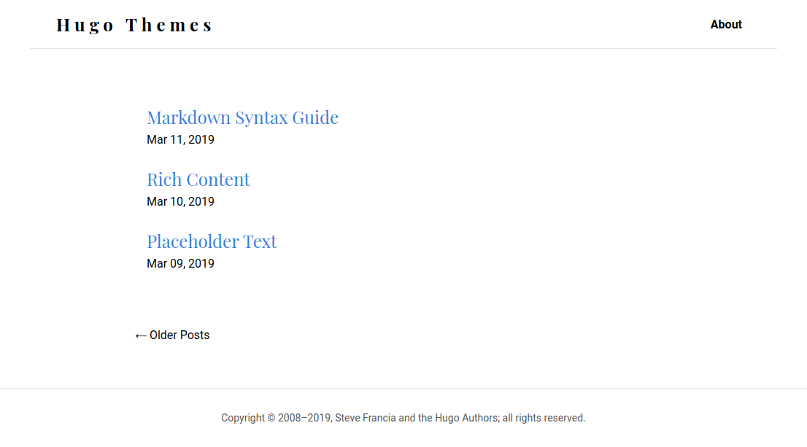

# blog-theme

[](https://app.netlify.com/sites/ndtho8205-blog-theme/deploys)



Demo is available [here](https://ndtho8205-blog-theme.netlify.com).

## Installation

Please refer to the [Hugo documentation](https://gohugo.io/themes/installing/).

## Configuration

```toml
baseURL = "https://example.org/"
title = "Example Site"
languageCode = "en-us"
theme = "blog-theme"

paginate = 5
enableEmoji = true
disqusShortname = ""
googleAnalytics = ""

[author]
  name = "Author"
  avatar = "/images/avatar.jpeg"
  github = "https://github.com/username"
  gitlab = ""
  linkedin = ""

[params]
  favicon = ""
  logo = ""

[menu]
  [[menu.main]]
    identifier = "about"
    name = "About"
    url = "/about/"
    weight = 30

[taxonomies]
  category = "categories"
  series = "series"
  tag = "tags"

```
